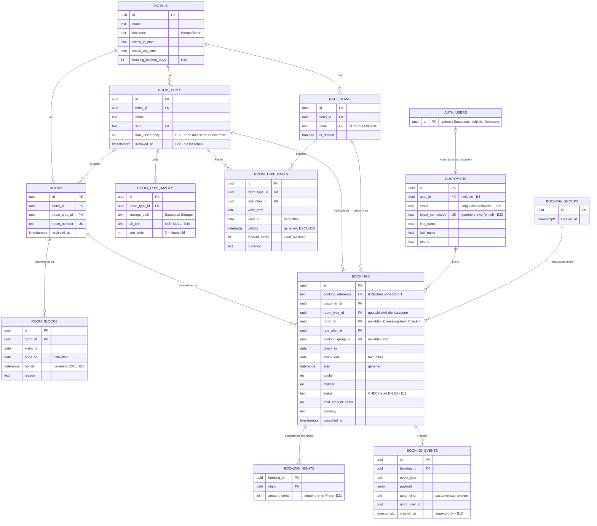

# Datenbank-Schema Hotelanwendung — Quelle der Wahrheit

> **Dies ist das normative Dokument.** Artifact-Seite und FigJam-Board sind **Ableitungen** (E9).
> Geändert wird immer erst hier.
>
> Begründung jeder Entscheidung: [README.md](./README.md) (E1–E36).
> Umsetzung: [umsetzungsplan.md](./umsetzungsplan.md).

---

## 1. ERD



---

## 2. Tabellen im Detail

Konventionen durchgehend (E8): englisch/`snake_case`/Plural, `uuid`-PK per `gen_random_uuid()`,
Geld als `integer` Cent, Zeiträume **halb-offen** `[von, bis)`, `created_at`/`updated_at` als
`timestamptz`.

`updated_at` wird nicht von der Anwendung gesetzt, sondern von einem Trigger
(`set_updated_at()`, eine Funktion für alle Tabellen). Ein Zeitstempel, den der Aufrufer pflegen
muss, ist irgendwann falsch. In den Spaltentabellen unten sind `created_at`/`updated_at` deshalb
nicht einzeln aufgeführt — sie sind überall vorhanden.

### `hotels` — genau eine Zeile (E14)

| Spalte | Typ | Regeln |
| --- | --- | --- |
| `id` | `uuid` | PK |
| `name` | `text` | `NOT NULL` |
| `address_line1`, `postal_code`, `city`, `country_code` | `text` | Stammdaten fürs Impressum |
| `email`, `phone` | `text` | Kontakt |
| `timezone` | `text` | `NOT NULL DEFAULT 'Europe/Berlin'` — definiert, was „heute" ist |
| `check_in_time`, `check_out_time` | `time` | `NOT NULL` |
| `booking_horizon_days` | `int` | `NOT NULL DEFAULT 540 CHECK (> 0)` (E30) |

Die Tabelle existiert **nicht** als Multi-Hotel-Vorbereitung, sondern weil diese Daten heute
gebraucht werden. Dass die Erweiterung dadurch billig wird, ist Nebenprodukt (E14).

### `room_types` — die verkaufte Einheit (E3)

| Spalte | Typ | Regeln |
| --- | --- | --- |
| `id` | `uuid` | PK |
| `hotel_id` | `uuid` | `NOT NULL REFERENCES hotels ON DELETE RESTRICT` |
| `name` | `text` | `NOT NULL` |
| `slug` | `text` | `NOT NULL`, `UNIQUE (hotel_id, slug)` — für sprechende URLs |
| `description` | `text` | |
| `max_occupancy` | `int` | `NOT NULL CHECK (max_occupancy >= 1)` (E15) |
| `archived_at` | `timestamptz` | `NULL` = aktiv (E22) |

### `rooms` — physische Zimmer

| Spalte | Typ | Regeln |
| --- | --- | --- |
| `id` | `uuid` | PK |
| `hotel_id` | `uuid` | `NOT NULL REFERENCES hotels ON DELETE RESTRICT` |
| `room_type_id` | `uuid` | `NOT NULL REFERENCES room_types ON DELETE RESTRICT` |
| `room_number` | `text` | `NOT NULL`, `UNIQUE (hotel_id, room_number)` |
| `archived_at` | `timestamptz` | archivierte Zimmer zählen **nicht** in die Kapazität |

### `room_type_images` (E19)

| Spalte | Typ | Regeln |
| --- | --- | --- |
| `id` | `uuid` | PK |
| `room_type_id` | `uuid` | `NOT NULL REFERENCES room_types ON DELETE CASCADE` |
| `storage_path` | `text` | `NOT NULL` — Pfad im Supabase-Storage-Bucket |
| `alt_text` | `text` | **`NOT NULL`** — Barrierefreiheit ist nicht optional |
| `sort_order` | `int` | `NOT NULL DEFAULT 0`; niedrigster Wert = Hauptbild |

`sort_order` ist bewusst **nicht** `UNIQUE`: sonst wird jedes Umsortieren zu einer Kette von
Zwischenschritten. Duplikate sind harmlos, die Sortierung wird per `(sort_order, id)` stabilisiert.

`ON DELETE CASCADE` ist hier korrekt und kein Widerspruch zu E22: Bilder sind kein Vertrag, sondern
Zubehör der Kategorie. Und eine Kategorie mit Buchungen ist ohnehin nicht löschbar.

### `room_blocks` — Sperrungen (E18)

| Spalte | Typ | Regeln |
| --- | --- | --- |
| `id` | `uuid` | PK |
| `room_id` | `uuid` | `NOT NULL REFERENCES rooms ON DELETE RESTRICT` |
| `starts_on`, `ends_on` | `date` | `NOT NULL`, `CHECK (ends_on > starts_on)` |
| `period` | `daterange` | `GENERATED ALWAYS AS (daterange(starts_on, ends_on, '[)')) STORED` |
| `reason` | `text` | `NOT NULL` — z. B. `renovierung`, `defekt`, `eigenbelegung` |
| `note` | `text` | Freitext |
| `created_by` | `uuid` | `REFERENCES auth.users` |

```sql
EXCLUDE USING gist (room_id WITH =, period WITH &&)
```

Sperrungen desselben Zimmers dürfen sich nicht überlappen — hier ist ein Exclusion-Constraint
richtig, weil er *ein Zimmer* betrifft. (Bei Buchungen geht das nicht, weil dort die Kategorie
gezählt wird → E3/E10.)

Eine Sperrung, die bestätigte Buchungen über die Kapazität hebt, wird **erlaubt und gemeldet**, nicht
verhindert (E18).

### `rate_plans` (E5)

| Spalte | Typ | Regeln |
| --- | --- | --- |
| `id` | `uuid` | PK |
| `hotel_id` | `uuid` | `NOT NULL REFERENCES hotels ON DELETE RESTRICT` |
| `code` | `text` | `NOT NULL`, `UNIQUE (hotel_id, code)` — v1 genau `STANDARD` |
| `name` | `text` | `NOT NULL` |
| `is_default` | `boolean` | `NOT NULL DEFAULT false` |
| `archived_at` | `timestamptz` | |

```sql
CREATE UNIQUE INDEX rate_plans_one_default_idx ON rate_plans (hotel_id)
    WHERE is_default AND archived_at IS NULL;
```

Der Seam, der „Flex / Nicht erstattbar / Frühbucher" später zu **Datenzeilen** macht statt zu einer
Schemaänderung. Der Teilindex erzwingt **höchstens einen** aktiven Standardtarif pro Hotel — ohne ihn
wäre „der Standard" eine Frage der Sortierreihenfolge und damit zufällig.

### `room_type_rates` — Saisonpreise (E5)

| Spalte | Typ | Regeln |
| --- | --- | --- |
| `id` | `uuid` | PK |
| `room_type_id` | `uuid` | `NOT NULL REFERENCES room_types ON DELETE RESTRICT` |
| `rate_plan_id` | `uuid` | `NOT NULL REFERENCES rate_plans ON DELETE RESTRICT` |
| `valid_from`, `valid_to` | `date` | `NOT NULL`, `CHECK (valid_to > valid_from)` |
| `validity` | `daterange` | generiert, halb-offen |
| `amount_cents` | `int` | `NOT NULL CHECK (amount_cents > 0)` |
| `currency` | `text` | `NOT NULL DEFAULT 'EUR' CHECK (char_length(currency) = 3)` |

```sql
EXCLUDE USING gist (room_type_id WITH =, rate_plan_id WITH =, validity WITH &&)
```

Zwei widersprüchliche Preise für dieselbe Nacht sind damit **unmöglich** — nicht „verboten laut
Doku", sondern von der Datenbank abgelehnt. Lücken bleiben erlaubt und bedeuten „nicht buchbar"
(E25).

### `customers` (E4, E26, E32)

| Spalte | Typ | Regeln |
| --- | --- | --- |
| `id` | `uuid` | PK |
| `user_id` | `uuid` | `UNIQUE NULL REFERENCES auth.users(id) ON DELETE SET NULL` |
| `email` | `text` | `NOT NULL` — Originalschreibweise, so wie der Gast sie eingegeben hat |
| `email_normalized` | `text` | `GENERATED ALWAYS AS (lower(email)) STORED`, `NOT NULL UNIQUE` (E32) |
| `first_name`, `last_name` | `text` | `NOT NULL` |
| `phone` | `text` | |

`ON DELETE SET NULL` ist hier — und **nur** hier — richtig, obwohl E22 `SET NULL` verwirft: Wird das
Supabase-Konto gelöscht, darf der Kunde samt Buchungen bestehen bleiben. Genau das ist der Sinn der
Trennung von `auth.users`.

**Zur Case-Insensitivität (E32):** Kein `citext`, kein funktionaler Index — eine **generierte
Spalte**. Der Vergleich ist damit eine Spalte und keine Konvention: gesucht wird immer über
`email_normalized = lower($1)`, und die Eindeutigkeit hängt an einem gewöhnlichen `UNIQUE`. Die
Originalschreibweise bleibt in `email` erhalten, weil sie in der Bestätigungsmail sichtbar ist. Die
Case-Insensitivität selbst ist nicht verhandelbar (E26) — nur ihr Mechanismus war offen.

### `booking_groups` (E27)

| Spalte | Typ | Regeln |
| --- | --- | --- |
| `id` | `uuid` | PK |
| `created_at` | `timestamptz` | `NOT NULL DEFAULT now()` |

Bewusst leer. Sobald sie Kunde, Buchungsnummer oder Gesamtsumme trägt, ist sie *der Vorgang* — und
dann ist E20 gefallen (siehe E27).

### `bookings` — der Vertrag

| Spalte | Typ | Regeln |
| --- | --- | --- |
| `id` | `uuid` | PK |
| `booking_reference` | `text` | `NOT NULL UNIQUE`, 8 Zeichen, Alphabet ohne `I O 0 1` (E23) |
| `customer_id` | `uuid` | `NOT NULL REFERENCES customers ON DELETE RESTRICT` |
| `room_type_id` | `uuid` | `NOT NULL REFERENCES room_types ON DELETE RESTRICT` |
| `room_id` | `uuid` | `NULL REFERENCES rooms ON DELETE RESTRICT` — Zuweisung beim Check-in (E3) |
| `rate_plan_id` | `uuid` | `NOT NULL REFERENCES rate_plans ON DELETE RESTRICT` |
| `booking_group_id` | `uuid` | `NULL REFERENCES booking_groups ON DELETE RESTRICT` |
| `check_in`, `check_out` | `date` | `NOT NULL`, `CHECK (check_out > check_in)` |
| `stay` | `daterange` | `GENERATED ALWAYS AS (daterange(check_in, check_out, '[)')) STORED` |
| `adults` | `int` | `NOT NULL CHECK (adults >= 1)` |
| `children` | `int` | `NOT NULL DEFAULT 0 CHECK (children >= 0)` |
| `status` | `text` | `NOT NULL DEFAULT 'confirmed'` + `CHECK` (E11) |
| `total_amount_cents` | `int` | `NOT NULL CHECK (>= 0)` — eingefroren (E5) |
| `currency` | `text` | `NOT NULL` |
| `cancelled_at` | `timestamptz` | denormalisiert für Abfragen (E22) |

```sql
CHECK (status IN ('confirmed','checked_in','checked_out','cancelled','no_show'))
CHECK ((status = 'cancelled') = (cancelled_at IS NOT NULL))

-- Sobald ein Zimmer zugewiesen ist, garantiert die DB die Eindeutigkeit:
EXCLUDE USING gist (room_id WITH =, stay WITH &&)
    WHERE (room_id IS NOT NULL AND is_blocking_status(status))
```

Das Prädikat ruft `is_blocking_status(status)` auf und wiederholt nicht `status <> 'cancelled'` —
die Regel steht sonst im Constraint, im Teilindex, in der Verfügbarkeitsrechnung und in jeder
Admin-Abfrage, und vier Kopien driften (E11). **Der Preis:** Weil Index und Constraint die Funktion
im Prädikat verwenden, verlangt jede Änderung an ihr ein `REINDEX TABLE bookings` — sonst
entscheidet der Index weiter nach der alten Regel, ohne dass etwas auffällt.

Der zweite `CHECK` ist als **Gleichheit zweier Wahrheitswerte** geschrieben und deckt damit beide
Richtungen ab: „storniert ohne Stornozeitpunkt" **und** „Stornozeitpunkt ohne Storno". Zwei getrennte
`CHECK`s wären leichter zu übersehen. Das Teil-Exclusion-Constraint ist ein **Geschenk**: Für die Kategorie-Zählung
hilft es nicht (E10 löst das per Advisory-Lock), aber ab dem Moment der Zimmerzuweisung ist
Doppelbelegung physisch unmöglich.

### `booking_nights` — eingefrorener Preis pro Nacht (E21)

| Spalte | Typ | Regeln |
| --- | --- | --- |
| `booking_id` | `uuid` | `REFERENCES bookings ON DELETE CASCADE`, Teil des PK |
| `night` | `date` | Teil des PK |
| `amount_cents` | `int` | `NOT NULL CHECK (>= 0)` |

`PRIMARY KEY (booking_id, night)`. Jede Nacht des halb-offenen Intervalls bekommt genau eine Zeile —
der Abreisetag **nicht**. Damit ist Umsatz pro Monat, Verlängerung und Teilstorno überhaupt
beantwortbar.

### `booking_events` — append-only Historie (E12)

| Spalte | Typ | Regeln |
| --- | --- | --- |
| `id` | `uuid` | PK |
| `booking_id` | `uuid` | `NOT NULL REFERENCES bookings ON DELETE RESTRICT` |
| `event_type` | `text` | `NOT NULL` — `created`, `cancelled`, `room_assigned`, `checked_in`, … |
| `payload` | `jsonb` | `NOT NULL DEFAULT '{}'` |
| `actor_kind` | `text` | `CHECK (actor_kind IN ('customer','staff','system'))` |
| `actor_user_id` | `uuid` | `REFERENCES auth.users` |
| `created_at` | `timestamptz` | `NOT NULL DEFAULT now()` |

Append-only wird **durchgesetzt**, nicht vereinbart: keine `UPDATE`- und keine `DELETE`-Policy, und
die Rechte werden entzogen — **auch dem `service_role`**. Der Service-Role-Key umgeht RLS
vollständig; ohne diesen Schritt könnte das Seed-Skript die Historie umschreiben. `INSERT` bleibt
ihm erlaubt, damit Ereignisse überhaupt entstehen können. Eine Historie, die man ändern kann, ist
keine.

---

## 3. Funktionen — hier leben die Geschäftsregeln

Ohne Backend ist die Datenbank die letzte Verteidigungslinie (Leitsatz 1). Alle Funktionen mit
`SECURITY DEFINER` erhalten ein fixiertes `search_path`.

| Funktion | Aufgabe | Entscheidung |
| --- | --- | --- |
| `is_staff()` | einziger Ort, an dem Mitarbeitendenrechte geprüft werden. v1: `false` | E13 |
| `current_customer_id()` | mappt `auth.uid()` → `customers.id`. Einziger Ort. | E13 |
| `is_blocking_status(text)` | `IMMUTABLE`; „belegt Kapazität" = alles außer `cancelled`. Einziger Ort. | E11 |
| `availability_nights(hotel, von, bis, erwachsene, kinder, kategorie?)` | **interner Kern** (E37): rohe Kapazitäts- und Preiszahlen pro Nacht und Kategorie, **ohne** Maskierung. Nicht für den Browser. | E17, E37 |
| `mask_reason(grund)` | Zweistufigkeit an einer Stelle: `ausgebucht`/`kein_preis`/`zu_klein` → `nicht_buchbar`, sofern nicht `is_staff()` | E28 |
| `availability_calendar(von, bis, erwachsene, kinder, kategorie?, hotel?)` | **eine Zeile pro Nacht**: `rooms_free`, `unavailable_reason`. Füttert den Kalender. | E24, E28 |
| `search_availability(anreise, abreise, erwachsene, kinder, hotel?)` | **eine Zeile pro Kategorie**: Minimum über den Zeitraum, Gesamtpreis. Füttert die Ergebnisliste. | E17, E28 |
| `reject_booking(code, datum)` | erzeugt die strukturierte Ablehnung; Code durch `mask_reason`, maschinenlesbare Fassung im `DETAIL` | E31 |
| `create_booking(...)` | Hotelweiter Advisory-Lock → Prüfung über `availability_nights` → `customers`-Upsert → `bookings` + `booking_nights` + `booking_events`, alles in **einer** Transaktion. Strukturierter Fehler bei Ablehnung. | E10, E26, E31, E32, E33 |
| `find_rate_gaps(tage)` | Admin: Nächte ohne Preiszeile | E25 |
| `rls_audit()` | Admin: Abnahme des Schutzes als Dauerprüfung. Keine Zeilen = in Ordnung. | E40 |

**Alle drei Verfügbarkeitsaufrufer lesen aus `availability_nights`** — Kalender,
Ergebnisliste und `create_booking`. Warum es drei Funktionen sind und nicht zwei: E37.

### Kapazität pro Nacht — die vollständige Formel

```text
kapazitaet(kategorie, nacht) =
      Anzahl aktive Zimmer der Kategorie
    − Anzahl an dieser Nacht gesperrte Zimmer der Kategorie      (E18)

frei(kategorie, nacht) =
      kapazitaet(kategorie, nacht)
    − Anzahl Buchungen der Kategorie, deren stay diese Nacht enthält
      und deren Status blockiert                                  (E11)
```

Ein Tageswert bedeutet **„diese Nacht ist verfügbar"** (E29). Die Oberfläche leitet daraus ab:

- **Anreisetag** wählbar, wenn *diese* Nacht frei ist
- **Abreisetag** wählbar, wenn die *vorherige* Nacht frei ist

Wer stattdessen den Tag komplett durchstreicht, macht Anschlussbuchungen unmöglich — der teuerste
Off-by-one-Fehler in Buchungssystemen.

### Sperrgründe — zweistufig (E28)

Intern: `ausgebucht`, `kein_preis`, `zu_klein`, `vergangenheit`, `ausserhalb_horizont`.
Nach außen sehen Gäste **nur** „Buchung nicht möglich" plus das betroffene Datum. Die feinen Codes
liefert die Funktion ausschließlich, wenn `is_staff()` wahr ist.

`ausgebucht` ist Erfolg, `kein_preis` ist ein Konfigurationsfehler — im Kalender sehen beide gleich
aus, für den Betrieb sind es entgegengesetzte Signale.

### `create_booking` — Ablauf

```text
1. pg_advisory_xact_lock(hashtext('booking:' || hotel_id))  -- EIN Lock fuers Hotel (E10, E33)
2. Horizont, Vergangenheit, Belegung pruefen        -- E30, E15
3. search_availability() fuer den Zeitraum          -- eine Wahrheit, kein Copy-Paste
4. bei Ablehnung: strukturierter Fehler
   { code, datum, grund }                          -- E31
5. customers: per email_normalized finden oder anlegen -- E26, E32
6. bookings einfuegen (Referenz erzeugen)           -- E23
7. booking_nights aus den Saisonpreisen einfrieren  -- E21
8. booking_events: 'created'                        -- E12
   -- bei mehreren Zimmern: booking_groups-Zeile + n bookings, alles in DIESER Transaktion (E20/E27)
```

Schritt 3 ruft dieselbe Funktion auf, die auch die Ergebnisliste füttert. Zwei Implementierungen
derselben Regel wären die eigentliche Fehlerquelle.

**Zu Schritt 1 (E33):** Der Lock ist **hotelweit**, nicht pro Kategorie. Eine feinere Granularität
sähe nach mehr Durchsatz aus, würde aber verlangen, dass eine Buchung über mehrere Kategorien
(E20/E27) mehrere Locks hält — und zwar in garantiert sortierter Reihenfolge, sonst verklemmen sich
zwei gleichzeitige Gruppenbuchungen gegenseitig. Bei einem Hotel dieser Größe ist der Durchsatz
belanglos, der Deadlock aber real. Wer das später ändern will, ändert nicht den Lock, sondern führt
die Inventartabelle aus E10 ein.

---

## 4. RLS — ab Tag 1, deny by default (E13)

Jede Tabelle bekommt `ENABLE ROW LEVEL SECURITY`. Policies **ausschließlich** über `is_staff()` und
`current_customer_id()` — kein verstreutes `auth.uid()`.

| Tabelle | lesen | schreiben |
| --- | --- | --- |
| `hotels` | alle | `is_staff()` |
| `room_types`, `room_type_images`, `rate_plans`, `room_type_rates` | alle (nicht archiviert) | `is_staff()` |
| `rooms`, `room_blocks` | nur `is_staff()` | `is_staff()` |
| `customers` | eigener Datensatz oder `is_staff()` | eigener Datensatz oder `is_staff()` |
| `bookings` | eigene oder `is_staff()` | **keine** Insert-Policy — nur über `create_booking()` |
| `booking_nights` | eigene (über Buchung) oder `is_staff()` | keine |
| `booking_events` | eigene oder `is_staff()` | keine (nur `SECURITY DEFINER`-Funktionen) |
| `booking_groups` | `is_staff()` | keine |

Der Key im Browser (`src/shared/services/supabase.ts`) ist kein Geheimnis, sondern eine öffentliche
Kennung. RLS *ist* der Schutz — es gibt keinen zweiten.

---

## 5. Indizes

| Index | Zweck |
| --- | --- |
| Teil-GiST `bookings(room_type_id, stay)` `WHERE is_blocking_status(status)` | Überlappungssuche der Verfügbarkeit; zählt nur, was zählt |
| GiST auf `room_blocks(period)` | Sperrungen pro Nacht |
| GiST via Exclusion auf `room_type_rates(validity)` | Preissuche + Überlappungsschutz |
| `bookings(customer_id)` | „meine Buchungen" im Kundenkonto |
| `bookings(check_in)`, `bookings(status)` | Admin-Listen |
| Teil-Index `bookings(booking_group_id)` `WHERE NOT NULL` | Zusammenhalt eines Vorgangs (E27) |
| Teil-Index `rooms(room_type_id)` `WHERE archived_at IS NULL` | Kapazitätszählung |
| `booking_events(booking_id, created_at)` | Historie einer Buchung in Reihenfolge |
| `room_type_images(room_type_id, sort_order, id)` | stabile Bildreihenfolge |

Zwei frühere Einträge sind hier bewusst **weggefallen**:

- Ein **zusätzlicher vollständiger** GiST-Index auf `bookings(room_type_id, stay)` neben dem
  Teil-Index. Die Verfügbarkeitsrechnung fragt ausschließlich nach blockierenden Buchungen; ein
  zweiter Index über alle Zeilen wäre Schreibaufwand bei jedem `INSERT`, den nie jemand liest.
- Ein eigener Index auf `bookings(booking_reference)`. Das `UNIQUE` legt ihn bereits an.

---

## 6. Was hier absichtlich fehlt (E15)

Ausstattungsmerkmale, Zusatzleistungen (Frühstück/Parkplatz), Zahlungen, Stornobedingungen,
Gutscheine, Mehrsprachigkeit, OTA-/Channel-Anbindung, Housekeeping-Abläufe.

Alle **additiv** nachrüstbar. Die einzige Erweiterung mit strukturellen Kosten ist
`bookings` → `bookings` + `booking_items` (E20/E27) — der Punkt, an dem man vorher nachdenkt.
